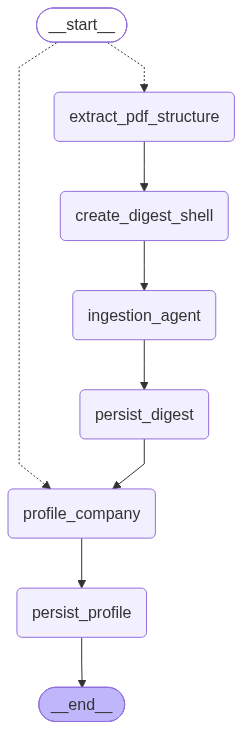
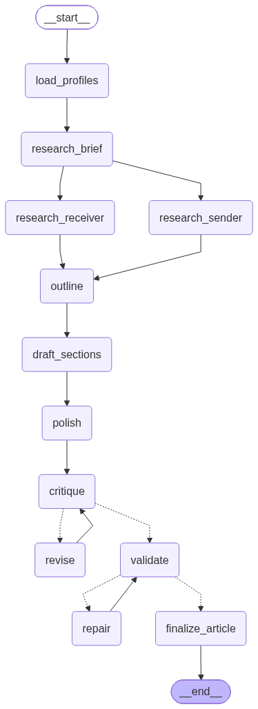

# LangGraph Agent Graphs

Rendered from the compiled graphs (`.get_graph().draw_mermaid_png()`), not hand-drawn — regenerate after any node/edge change:

```
.venv/bin/python -c "
from app.graphs.generation_graph import build_generation_graph
from app.graphs.ingestion_graph import build_ingestion_graph
open('docs/graphs/generation_graph.png','wb').write(build_generation_graph(None).get_graph().draw_mermaid_png())
open('docs/graphs/ingestion_graph.png','wb').write(build_ingestion_graph(None).get_graph().draw_mermaid_png())
"
```

## Ingestion graph (`app/graphs/ingestion_graph.py`)

Runs on `POST /context`. `extract_pdf_structure` / `profile_company` fork depending on whether a PDF was uploaded — see `route_from_entry`.



- `extract_pdf_structure` — parses the PDF (transcript, tables, image map). Skipped on a no-PDF (name/description-only) run.
- `create_digest_shell` — inserts the `PdfDigest` row early so `describe_image` has a `pdf_digest_id` to scope `Image` rows to this run.
- `ingestion_agent` — agentic loop (`app/graphs/ingestion_agent.py`) merging text + image summaries into a digest.
- `persist_digest` — writes `digest_text`/`key_facts`/`document_type` back onto the `PdfDigest` row.
- `profile_company` — LangChain deep-research agent (`app/deep_research.py`), web-search-grounded; entry point directly on a no-PDF run.
- `persist_profile` — writes the new `CompanyProfile` version (never overwrites a prior one).

## Generation graph (`app/graphs/generation_graph.py`)

Runs on `POST /generate`. STORM-style: research the two companies for *this* pairing, outline before writing,
draft section by section, then polish/critique/validate. `critique` loops back through `revise` (at most
`MAX_REVISE_ATTEMPTS`, 1) before `validate`; `validate` loops back through `repair` (at most `MAX_REPAIR_ATTEMPTS`,
2) before falling through to `finalize_article`. See `docs/adr/0003-generation-research-and-storm-drafting.md`.



- `load_profiles` — loads latest sender/receiver `CompanyProfile` rows and company names.
- `research_brief` — no-tool LLM call turning both profiles + the creative brief into a concrete per-company research dimension list.
- `research_sender` / `research_receiver` — run in parallel; each is an isolated `deepagents.create_deep_agent` (same idiom as `app/deep_research.py`) with a `web_search` tool and a `fact-finder` sub-agent, budgeted in-prompt to ~5 searches. Structured output is a list of facts with source URLs — the research pass and the "compress" step are the same call: the agent's final structured answer *is* the cleaned fact list.
- `outline` — LLM call mapping template slots (headline, each section, pull quote, CTA) to a specific subset of the researched facts, before any prose exists.
- `draft_sections` — one structured-output call per template unit (headline+subheadline together, each body section, pull_quote+cta together), each fed only its outline-assigned facts and the receiver's tone_signals.
- `polish` — assembles the drafted pieces into one `ArticleSchema`: smooths transitions, dedupes, strengthens the lead, picks image placeholder asset aliases, and lists the `sources` actually used. Keeps a `polish_messages` conversation for `revise` to extend.
- `critique` — rubric LLM call (fact grounding, personalization, tone match, structure) producing concrete `required_edits`.
- `revise` — appends one turn to `polish_messages` applying the critique's edits, re-emits the corrected `ArticleSchema`. Loops back to `critique`.
- `validate` — checks word limits/min-lengths per field and required image slots.
- `repair` — appends one turn to the draft conversation (continuing from `polish_messages`) batching every current violation (word limits, missing sections/slots, invalid asset aliases) and re-emits the full corrected article; the stable conversation prefix makes each repair round a prompt-cache hit. Loops back to `validate`.
- `finalize_article` — truncates any field still over limit after repair attempts are exhausted, resolves the draft's chosen asset aliases to `Image` rows (sender assets only; the model picks from a catalog in its prompt) or falls back to a stock-query hint.
